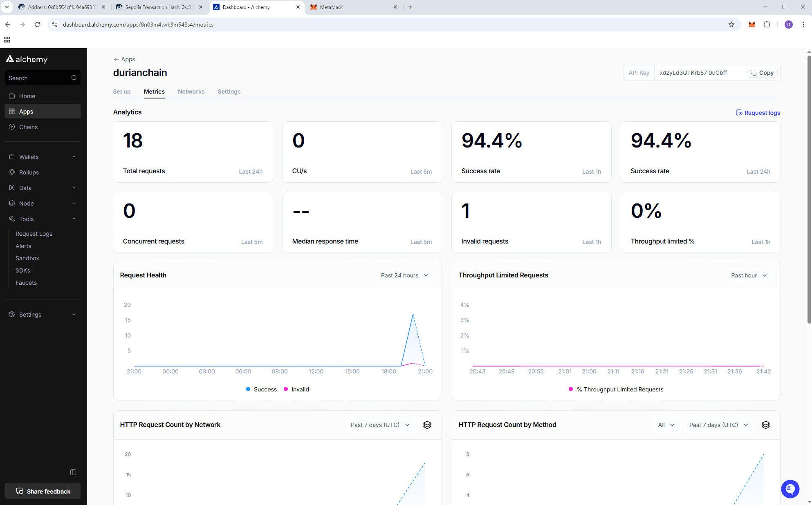

# DurianChain – Blockchain-based Durian Traceability System

DurianChain is a de
centralized application designed to track the journey of durians from farms to consumers using blockchain technology.  
The system ensures authenticity, transparency, and traceability by storing critical supply chain events on-chain, with supporting documents stored via IPFS.

---

## 🚀 Testnet Deployment
As part of the development process, **DurianChain has been deployed to the Sepolia Testnet** to validate smart contract interactions and blockchain integration before mainnet launch.  
This additional step ensures that all role-based functions and transaction flows work as intended in a real blockchain environment.

You can view and monitor the deployment through the Alchemy dashboard:  
[https://dashboard.alchemy.com/](https://dashboard.alchemy.com/)
---
## 🛠 How to Get Test Sepolia ETH (sepETH)
To interact with the testnet deployment, you will need Sepolia ETH for gas fees.

1. Go to the **Sepolia Faucet**: [https://sepolia-faucet.pk910.de/](https://sepolia-faucet.pk910.de/)
2. Connect your **MetaMask** or preferred Ethereum wallet.
3. Request test ETH by following the on-screen instructions.
4. Wait for the transaction to confirm, then refresh your wallet to see the balance.

## 🔗 Related Documentation
For full instructions on compiling, deploying, and verifying the DurianChain smart contract,  
please refer to the **[Blockchain Deployment Section in README.md](./README.md#blockchain-hardhat--solidity)**.

---

