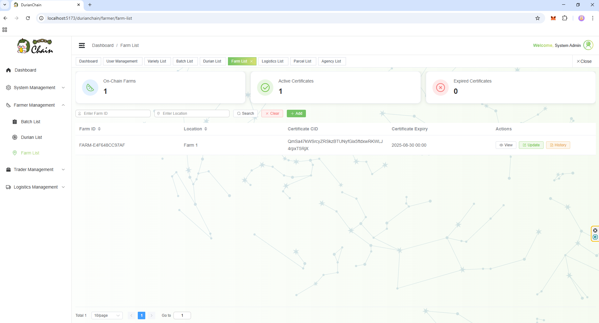
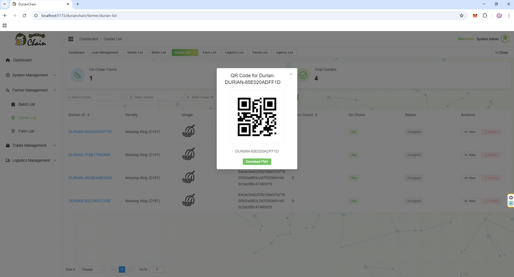

# DurianChain – User Guidelines

## Overview
DurianChain is a blockchain-powered durian traceability system designed to ensure transparency and authenticity across the supply chain. This guide explains how each type of user can interact with the platform.

---

## User Roles and Their Functions
### 1. **Admin**
**Scope of Authority**
- **User Management (Approve / Edit Role only)**
    - Review new user sign-ups.
    - **Approve** accounts and **edit roles** (Farmer, Logistics, Retailer/Exporter).
    - ❗ **No add or delete users** — to preserve decentralization and on-chain identity continuity.

- **Durian Variety Management (Add / Edit / Delete)**
    - Maintain the master list of durian varieties (e.g., Musang King, D24, Black Thorn).
    - Add new varieties, update names/codes, and remove deprecated entries.

**Images**

### 2. **Farmer**
**Scope of Authority**
- **Farm Management (Create / Update)**
  - Register a new farm with essential details.
  - Upload **MyGAP certificate** (if available) during creation.
  - Update certificate information at any time.
  - View complete **farm history** for reference and compliance tracking.

- **Durian Registration (Create / Delete)**
  - Create new durian records linked to a specific farm.
  - Upload durian images for verification.
  - Each durian entry is stored with a **hash value** for authenticity verification.
  - Delete durian entries **only if not yet assigned** to any batch.

- **Batch Management (Create / Update / Delete)**
  - Create durian batches with images; images are uploaded to **Pinata** and stored via **CID**.
  - Assign durians to batches and view complete batch details.
  - Update batch details **only if the batch has not been ordered yet**.
  - Delete batches **only if they have not been ordered yet**.

- **Milestone Tracking**
  - Each order is assigned a milestone timeline.
  - Milestones can be viewed from the **beginning of batch creation** until final delivery.
  - Status updates reflect real-time progress for both local and export orders.

**Images**

**Farm**

**Durian**

**Batch**

## 3. **Trader**
**Scope of Authority**
- **Agency Management (Create / Update)**
  - Register a new agency with essential details.
  - Upload **agency certificate** during creation; certificate file will be uploaded to **Pinata** and stored via **CID**.
  - Update certificate information at any time.
  - View complete **agency history** for reference and compliance tracking.

- **Ordering Durian Batches**
  - Place orders for durian batches created by farmers.
  - Export is allowed **only if**:
    - The selected farm has a valid certificate.
    - The selected agency has a valid certificate.
  - Provide shipping **destination address** for the order.
  - Specify order type: **Local Order** or **Export**.

**Images**

**Agency**

**Order**

## 4. **Logistics**
**Scope of Authority**
- **Company Management (Create / View)**
  - Register a new logistics company with the company name only (no certificate required).
  - No update or delete functions; company records can only be viewed.

- **Order Pickup and Delivery**
  - View orders placed by traders.
  - During pickup update, the logistics staff must **select the company** that will handle the delivery.
  - Update order status in the following sequence:
    1. **Ordered** → mark as **Collected** (after selecting a logistics company and confirming pickup).
    2. **Collected** → mark as **Delivered** (when parcel is completed and handed over to destination).
  - Once marked as **Delivered**, the process is considered complete.

**Images**

**Logistics Company**

**Parcel**

## 5. **Consumer**
**Scope of Authority**
- **QR Code Scanning**
  - Upload or scan the **QR code** of a durian or a batch.

- **Batch Tracking**
  - If a **batch QR code** is scanned:
    - Display the entire process history of the batch.
    - If the batch process is still ongoing, show the progress up to the current stage.
    - List all durians included in the batch.

- **Durian Tracking**
  - If a **durian QR code** is scanned:
    - Show the batch information the durian belongs to.
    - Display the **durian scan count** (how many times the durian has been scanned).
    - Increment the scan count by **+1** each time it is scanned.

**Images**

**Batch**

**Durian**

## 6. **Home Page**
- **Login & Registration**
  - Access the system via the home page with options to **Login** or **Register**.
  - New users must register with required details before accessing their role-specific dashboards.
  - Existing users can log in to manage their role-specific functions.

**Images**

## 7. **Default Users**
For testing and demonstration purposes, the following default accounts are available:

| Role       | Username       | Password |
|------------|----------------|----------|
| Admin      | admin          | 123456   |
| Farmer     | farmer         | 123456   |
| Trader     | trader         | 123456   |
| Logistics  | logistics      | 123456   |